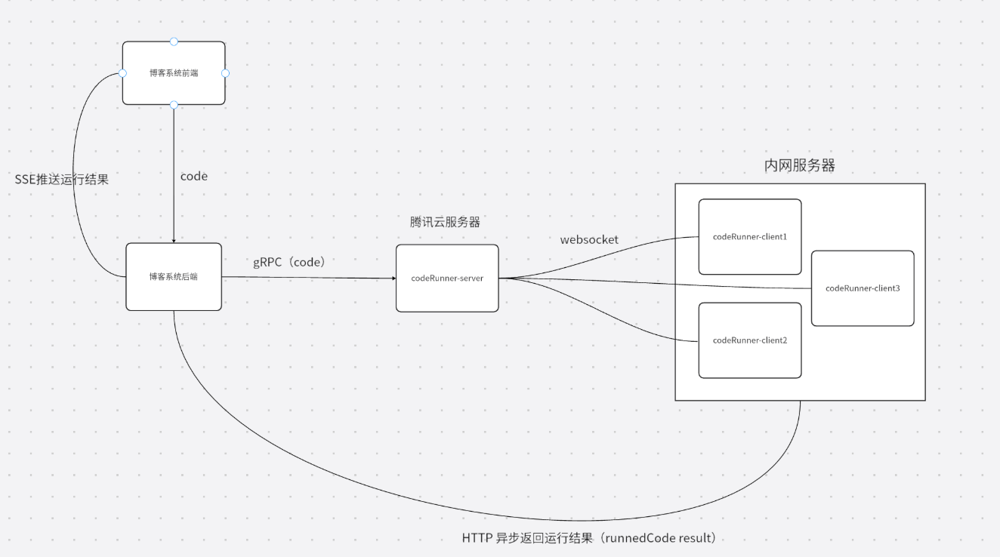

# CodeRunner

**让博客读者直接在浏览器中运行代码，无需跳转 IDE。**

CodeRunner 是一个分布式代码执行后端，基于 DDD 架构设计。云端 Server 负责任务调度，内网 Client 节点在 Docker 沙箱中安全执行代码，支持 Go / Python / JavaScript / Java / C++ 五种语言。灵感来源于 Online Judge 系统。

## 特性

- **分布式执行** — 云端调度 + 内网节点执行，水平扩展 Client 即可提升吞吐
- **安全沙箱** — 每个任务运行在独立 Docker 容器中，严格限制 CPU / 内存 / 网络 / 文件系统
- **智能负载均衡** — P2C + EWMA 自适应算法，慢节点自动降权，支持防饥饿与健康感知
- **实时通信** — WebSocket 双向连接 + SSE 推送，代码执行结果实时送达前端
- **服务发现** — 基于 ETCD 的节点自动注册与发现
- **AI Agent 集成** — 内置代码学习助手，支持代码解释、问答、调试建议（可选）

## 架构



```
博客前端 ──HTTP+SSE──▶ 博客后端 ──gRPC──▶ CodeRunner Server ──WebSocket──▶ Client 节点
                         ◀──HTTP Callback──────────────────────────────────┘
```

| 通信路径 | 协议 | 说明 |
|---------|------|------|
| 博客后端 → Server | gRPC | 提交执行任务 |
| Server → Client | WebSocket | 双向实时任务分发 |
| Client → 博客后端 | HTTP Callback | 异步回调执行结果 |
| 博客后端 → 前端 | SSE | 推送结果到浏览器 |

## 快速开始

### 环境要求

- Go 1.25+
- Docker 24.0+
- ETCD 3.5+

### 1. 设置环境变量

```bash
# 必需 - gRPC 鉴权
export JWT_SECRET="your-jwt-secret"
export AUTH_PASSWORD="your-auth-password"

# 可选 - Agent 模块（代码学习助手）
export AGENT_API_KEY="sk-your-api-key"  # 公共博客系统需要，个人博客可不设
export QWEN_API_KEY="sk-your-qwen-key"  # 或其他 AI provider 的 key
```

**Agent 鉴权模式：**

- **个人静态博客**：不设置 `AGENT_API_KEY`，前端无需鉴权直接调用
- **公共博客系统**：设置 `AGENT_API_KEY`，前端需在请求 header 中携带 `X-Agent-API-Key`

### 2. 启动 Server（云服务器）

```bash
# 修改 cmd/api/main.go 调用 initialize.RunServer()
go run cmd/api/main.go
```

### 3. 启动 Client（执行节点）

```bash
# 修改 cmd/api/main.go 调用 initialize.RunClient()
go run cmd/api/main.go
```

配置文件：`configs/dev.yaml`（开发） / `configs/product.yaml`（生产）

## 项目结构

```
codeRunner-backend/
├── cmd/api/                  # 应用入口（Server / Client 模式切换）
├── api/proto/                # gRPC Protobuf 定义
├── configs/                  # 环境配置
├── builds/
│   ├── api/                  # Server 镜像构建
│   └── runners/              # 语言运行时镜像（Go / Python / JS / Java / C++）
├── docker-compose/           # 容器编排（dev / product）
├── docs/                     # 需求文档 / 技术方案 / 测试计划
└── internal/                 # 核心代码（DDD 分层）
    ├── interfaces/           # 接口层 — gRPC / HTTP / WebSocket 控制器
    ├── application/          # 应用层 — 业务流程编排
    ├── domain/               # 领域层 — 核心业务逻辑
    └── infrastructure/       # 基础设施层
        ├── balanceStrategy/  #   负载均衡（P2C + EWMA）
        ├── websocket/        #   WebSocket 通信
        ├── containerBasic/   #   Docker 容器管理
        ├── etcd/             #   服务注册与发现
        └── common/           #   配置 / 日志 / 认证等公共组件
```

## 技术栈

| 类别 | 技术 |
|------|------|
| 语言 | Go 1.25 |
| 架构 | DDD（领域驱动设计） |
| RPC | gRPC + Protobuf |
| 实时通信 | gorilla/websocket |
| 服务发现 | ETCD |
| 容器化 | Docker SDK |
| 配置 | Viper |
| 日志 | Zap |
| 监控 | Prometheus |

## API 接口

### 代码执行（gRPC）

```protobuf
service CodeRunner {
  rpc Execute(ExecuteRequest) returns (ExecuteResponse);
  rpc GenerateToken(TokenRequest) returns (TokenResponse);
}
```

需要 JWT Token 鉴权（通过 `GenerateToken` 获取）。

### AI Agent（HTTP）

**POST /agent/chat** — 代码学习助手对话

```bash
curl 'http://your-server:7979/agent/chat' \
  -H 'Content-Type: application/json' \
  -H 'X-Agent-API-Key: sk-xxx' \  # 仅公共博客系统需要
  --data-raw '{
    "session_id": "",
    "user_message": "请解释这段代码",
    "article_ctx": {
      "title": "文章标题",
      "code": "print(\"hello\")",
      "language": "python"
    }
  }'
```

响应格式：SSE 流式推送

**POST /agent/confirm** — 确认 Agent 提议的操作

配置：`configs/product.yaml` 中 `agent.enabled: true` 启用

## 安全

- 每个任务在独立 Docker 容器中运行，容器级资源隔离
- 严格限制 CPU、内存、执行时间，代码块上限 64KB
- 容器默认禁用网络访问，无法访问宿主机文件系统
- gRPC 接口通过 JWT Token 鉴权，Secret 从环境变量注入

## 负载均衡

使用 P2C（Power of Two Choices）+ EWMA 自适应算法：

```
load = sqrt(ewma_latency + 1) * (inflight + 1) / weight
```

随机取两个节点，选 load 更低的。超过 1s 未被选中的节点强制调度一次（防饥饿），成功率低于 50% 的节点自动惩罚。

详见 [P2C 负载均衡说明](internal/infrastructure/balanceStrategy/p2cBalance/README.md)。

## 文档

项目采用 Spec-Driven Development 工作流，详见 [CLAUDE.md](CLAUDE.md)。

| 文档 | 路径 |
|------|------|
| 产品需求 | `docs/context/requirements/` |
| 技术方案 | `docs/context/designs/` |
| 测试计划 | `docs/context/test-plans/` |

## License

MIT
